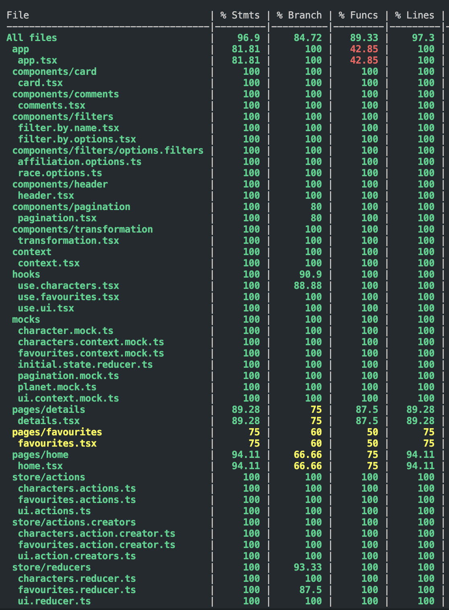

# Dragon Ball App

A web application for exploring information about Dragon Ball characters.

## Demo

Visit the [live demo](https://dragonball-app.vercel.app/)

## Key Features

- View a list of characters.
- Filter characters by race and affiliation.
- Pagination for navigating through the list.
- Add characters to favorites.
- Add comments to each character.
- Dark mode for a personalized visual experience.

## Technologies Used

- TypeScript
- React
- React Hooks (context and flux)
- SASS (SCSS / Flexbox and Grid)
- Jest (Jest DOM and React Testing Library)
- React Router DOM

## Installation

1. Clone the repository: `git clone https://github.com/YOUR_USERNAME/dragonball-app.git`
2. Install dependencies: `npm install`
3. Start the application: `npm start`

## Usage

1. Explore the list of characters.
2. Use filters to find specific characters.
3. Navigate through pages to view more characters.
4. Add characters to your favorites.
5. Leave comments on your favorite characters.
6. Switch to dark mode for a different visual experience.

## Contribution

Contributions are welcome! If you'd like to contribute, follow these steps:

1. Fork the repository.
2. Create a new branch: `git checkout -b new-feature`
3. Make your changes and commit: `git commit -m 'Add new feature'`
4. Push your changes: `git push origin new-feature`
5. Open a Pull Request.

## Testing coverage:

